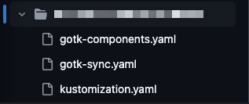
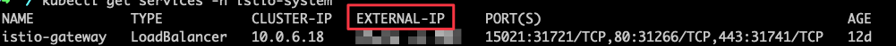

# dpn-flux-deployment

This repository contains the deployment configuration for the DPN Flux application. The deployment configuration is managed using [Helm](https://helm.sh/). 
Helm is a package manager for Kubernetes that allows you to define, install, and upgrade Kubernetes applications.

## Prerequisites
To deploy the DPN Flux application, you will need the following tools installed on your local machine:
- [Helm](https://helm.sh/)
- [Kubectl](https://kubernetes.io/docs/tasks/tools/install-kubectl/)
- [Flux CLI](https://fluxcd.io/flux/installation/)
- [K9s](https://k9scli.io/topics/install/) - Helps to manage the Kubernetes cluster

## Authenticate on AKS Cluster

Once the prerequisites are installed first step is to login into the Azure AKS cluster in order to run the Flux bootstrap process.

### Step 1 - Login to Azure using Azure CLI

In your terminal log into your Azure tenant 
``` bash
az login --tenant 00000000-0000-0000-0000-000000000000
#Set a subscription to be the current active subscription
az account set -s #Name of Azure Subscription
```

### Step 2 - Authenticate to AKS Cluster
In your terminal
`az aks get-credentials --resource-group AKS_RESOURCE_GROUP --name NAME_OF_CLUSTER`

### Step 3 - Test connection to the AKS cluster
In your terminal
Run `kubectl get pods -A` Follow the on-screen instructions.

Once you have successfully received a response from all the pods in the cluster, you can confirm that you have successfully authenticated to it.

## Flux Bootstrap
Install the Flux controllers
The recommended way of installing Flux on Kubernetes clusters is by using the bootstrap procedure.

## Bootstrap with Flux CLI
The flux `bootstrap` command deploys the Flux controllers on Kubernetes cluster(s) and configures the controllers to sync the cluster(s) state from a Git repository. 
Besides installing the controllers, the bootstrap command pushes the Flux manifests to the Git repository and configures Flux to update itself from Git.

The flux bootstrap GitHub command deploys the Flux controllers on a Kubernetes cluster and configures the controllers to sync the cluster state from a GitHub repository. Besides installing the controllers, the bootstrap command pushes the Flux manifests to the GitHub repository and configures Flux to update itself from Git.

After running the bootstrap command, any operation on the cluster (including Flux upgrades) can be done via Git push, without the need to connect to the Kubernetes cluster.

#### To bootstrap Flux, the person running the command must have cluster admin rights for the target Kubernetes cluster. It is also required that the person running the command to be the owner of the GitHub repository, or to have admin rights of a GitHub organisation.

``` bash
  flux bootstrap git \
  --url=ssh://git@github.com/<org>/<repository> \
  --branch=<my-branch> \
  --private-key-file=<path/to/ssh/private.key> \
  --password=<key-passphrase> \
  --path=clusters/my-cluster #CHANGE_TO_CLUSTER_NAME
```

Once the above command has been executed it will create the sub-directory in `clusters` with the base configuration of `flux-system`



The above directory is created after the initial bootstrap process has been run. Within the `dpn-flux-repository` you will only need to overwrite the `kustomization.yaml` file.

**DO NOT OVERWRITE `gotk-components.yaml` & `gotk-sync.yaml`**

---

## Setup DPN

### Step 1
On the newly created flux repository checkout a new branch

###### For all the steps below that involve copying directories from `dpn-flux-deployment`, ensure that the directories are copied to the same corresponding destination path.

### Step 2
Copy the following directories from `dpn-flux-deployment`

|    | Source                                                         | Destination                                                |
|----|:---------------------------------------------------------------|:-----------------------------------------------------------|
| 1. | `dpn-flux-deployment/clusters/CHANGE_TO_CLUSTER_NAME/configs`  | `YOUR_REPOSITORY_NAME/clusters/YOUR_CLUSTER_NAME/configs`  |
| 2. | `dpn-flux-deployment/clusters/CHANGE_TO_CLUSTER_NAME/workload` | `YOUR_REPOSITORY_NAME/clusters/YOUR_CLUSTER_NAME/workload` |
| 3. | `dpn-flux-deployment/infrastructure`                           | `YOUR_REPOSITORY_NAME/`                                    |
| 4. | `dpn-flux-deployment/telicent`                                 | `YOUR_REPOSITORY_NAME/`                                    |
| 5. | `dpn-flux-deployment/.pre-commit-config.yaml`                  | `YOUR_REPOSITORY_NAME/`                                    |
| 6. | `dpn-flux-deployment/flux-system/kustomization.yaml`           | Replace the contents of `dpn-flux-deployment/flux-system/kustomization.yaml` to `YOUR_REPOSITORY_NAME/flux-system/kustomization.yaml`                                    |

### Step 3

## Obtaining public IP Address (Ingress Gateway)
To allow incoming connections to the **DPN** and **Keycloak**, you need to obtain the external IP address. Run the following command to retrieve it:
`kubectl get service -n istio-system`

This command will display the list of services running in the istio-system namespace, including their external IP addresses.



Once you have obtained create a public DNS entry for the DPN software and Keycloak providing the External IP of the `istio-gateway` e.g. of DNS 

- data-sharing.YOUR_DOMAIN
- keycloak-data-sharing.YOUR_DOMAIN
- authorisation-data-sharing.YOUR_DOMAIN

### Step 4
#### Setup Keycloak
Follow the guide [keycloak-setup](keycloak_instructions/Keycloak%20Setup%20Instructions.pdf)


### Step 5

#### Setup dpn-flux-deployment/clusters/CHANGE_TO_CLUSTER_NAME/configs

Within the kustomization.yaml file, you will need to update the following values:
- authorisation_api_domain - e.g authorisation-data-sharing.YOUR_DOMAIN
- cert_manager_email - your email address
- cluster_env - AKS cluster name 
- cluster_name - AKS cluster name
- data_producer1_domain - network participant domain name
- data_producer2_domain - network participant domain name
- data_producer3_domain - network participant domain name
- domain - your domain name e.g data-sharing.YOUR_DOMAIN
- federator_server_domain - e.g federator-data-sharing.YOUR_DOMAIN
- ia_domain - e.g e.g data-sharing.YOUR_DOMAIN
- keycloak_domain - e.g keycloak-data-sharing.YOUR_DOMAIN
- oauth2_proxy_client_secret - oauth2_proxy_client_secret from Keycloak
- oauth2_proxy_cookie_secret - Create a 32 byte secret e.g. `openssl rand -base64 32 | tr -d '\n' | tr '+/' '-_'`

#### Update the dpn-flux-deployment/flux-system/kustomization.yaml
- Line 18 with the AKS cluster name
- Line 19 with the AKS cluster name
- Line 20 with the domain name e.g data-sharing.YOUR_DOMAIN
- Line 21 environment eg `dpn`
- Line 30 with the helm managed identity the client id
- Line 31 with the Azure Tenant ID
### Step 6

#### Update the dpn-flux-deployment/workload/

The workload directory contains the DPN configuration files. As part of the deployment process, the Azure Cosmos DB and Event Hubs configuration details are required to populate the necessary configuration files.


#### Update /dpn-flux-deployment/clusters/CHANGE_TO_CLUSTER_NAME/workload/core/2-access/api/patches/config/api.env

The api.env file populate 
- Line 1 with the APP Domain e.g. data-sharing.YOUR_DOMAIN. 
- Line 3 the Cosmos DB Hostname. 
- Line 4 the Mongo User. 
- Line 5 the Keycloak Domain e.g. keycloak-data-sharing.YOUR_DOMAIN. 
- Line 7 the Cosmos Host Name, 
- Line 8 the Cosmos Port. 
- Line 9 the Cosmos Query String e.g. `?ssl=true&replicaSet=globaldb&maxIdleTimeMS=120000&appName=@[COSMOS_DB_NAME]@`

#### Update /dpn-flux-deployment/clusters/CHANGE_TO_CLUSTER_NAME/workload/core/2-access/ui/patches/config/env-config.js
- Line 1 with the APP Domain e.g. data-sharing.YOUR_DOMAIN. 

#### Update /dpn-flux-deployment/clusters/CHANGE_TO_CLUSTER_NAME/workload/core/3-smart-cache-graph/server/config/config.ttl
- Line 253 with the Event Hub Name
- Line 268 with the Event Hub Name

#### Update /dpn-flux-deployment/clusters/CHANGE_TO_CLUSTER_NAME/workload/core/4-query/ui/patches/config/env-config.js
- Line 1, 3, 4 replace `change.me.to.the.apps.host` with the APP Domain e.g. data-sharing.YOUR_DOMAIN.

#### Update /dpn-flux-deployment/clusters/CHANGE_TO_CLUSTER_NAME/workload/federation/1-server/kafka-config.properties
- Line 10 add the Event Hub Connection String within `password=""`

#### Update /dpn-flux-deployment/clusters/CHANGE_TO_CLUSTER_NAME/workload/federation/1-server/server.properties
- Line 1 add the EventHub FQDN e.g. `eventhub-data-sharing.servicebus.windows.net:9093`

#### Update /dpn-flux-deployment/clusters/CHANGE_TO_CLUSTER_NAME/workload/federation/3-outgoing-filter/patches/config/config.env
- Line 3 add the EventHub FQDN e.g. `eventhub-data-sharing.servicebus.windows.net:9093`

#### Update /dpn-flux-deployment/clusters/CHANGE_TO_CLUSTER_NAME/workload/federation/clients/

Within the clients directory will be specific network partner configuration setup. Recommendation to rename the directory to the network partner name.

The incoming filter directory needs to match the network partner name.

The changes required in the client directory are as follows:
- client.properties - Line 3 add the EventHub FQDN e.g. `eventhub-data-sharing.servicebus.windows.net:9093`
- kafka-config.properties - Line 10 add the Event Hub Connection String within `password=""`

Within the incoming filter directory the changes required are as follows:
- config.env
  - Line 3 add the EventHub FQDN e.g. `eventhub-data-sharing.servicebus.windows.net:9093`
  - Line 6, 7, 8 change the `client-*` placeholder to the network partner name

  ---

### Step 7

#### Update the dpn-flux-deployment/infrastructure/authorisation-api/configmap.yaml
- Line 10 the Cosmos DB Name
- Line 11 the Cosmos DB Host Name
- Line 12 the Cosmos DB Port
- Line 13 replace `YOUR_COSMOS_DB_NAME` with the Cosmos DB Name

#### Update the dpn-flux-deployment/infrastructure/data-pipelines/releases.yaml
- Find and replace `YOUR_ACR_NAME` with the Azure Container Registry Name
- FInd and replace `YOUR_IMAGE_SEMVER` with the version number within your Container Registry